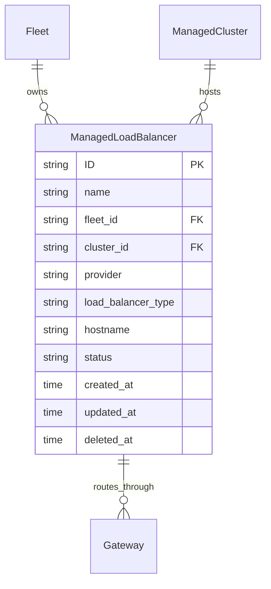

# ManagedLoadBalancer Specification

**Date:** 2026-08-14
**Status:** Draft
**Parent:** `data-model.spec.md` - HyperShell data model

---

## Purpose

Each OpenShell Gateway currently provisions its own Kubernetes Gateway API `Gateway` resource, which creates a dedicated cloud load balancer (e.g., an AWS Classic Load Balancer). Each load balancer consumes scarce infrastructure resources — an AWS ELB requires at least 8 free IP addresses per subnet. This model does not scale: a subnet with 40 usable IPs can host at most 4–5 gateways before new load balancers fail to provision.

This specification introduces `ManagedLoadBalancer` as a fleet-scoped managed resource, following the same pattern as `ManagedCluster` and `ManagedDatabase`. A `ManagedLoadBalancer` represents a shared cloud load balancer that multiple Gateways route through via individual `GRPCRoute` resources, replacing the current one-load-balancer-per-gateway model.

This is analogous to ROSA, where a cluster is created in a VPC that must have enough IPs. Here, a Gateway is assigned to a `ManagedLoadBalancer` that must have capacity in its subnet.

---

## Requirements

### Requirement: ManagedLoadBalancer Kind

The API server SHALL support a `ManagedLoadBalancer` kind as a fleet-scoped resource. A `ManagedLoadBalancer` represents a shared cloud load balancer provisioned on a specific cluster.

| Field | Type | Required | Description |
|---|---|---|---|
| `id` | string | Read-only | KSUID assigned by the API server |
| `name` | string | Yes | Human-readable name |
| `fleet_id` | string (FK) | Yes | Owning Fleet |
| `cluster_id` | string (FK) | Yes | ManagedCluster where the load balancer is provisioned |
| `provider` | string | Yes | Cloud provider: `aws`, `gcp`, `azure` |
| `load_balancer_type` | string | No | Load balancer type: `classic`, `nlb`, `application`. Default: `classic` |
| `hostname` | string | Read-only | DNS hostname of the provisioned load balancer, populated by the control-plane reconciler |
| `status` | string | Read-only | Operational status: `Pending`, `Provisioning`, `Ready`, `Error` |

#### Scenario: Create ManagedLoadBalancer

- GIVEN a valid fleet_id and cluster_id
- WHEN a POST request is made to `/api/hypershell/v1/managed_load_balancers`
- THEN a new ManagedLoadBalancer is created with a KSUID
- AND the status SHALL be `Pending`

#### Scenario: ManagedLoadBalancer Lifecycle

- GIVEN a ManagedLoadBalancer in status `Pending`
- WHEN the control-plane reconciler provisions the Kubernetes Gateway API `Gateway` resource and the cloud load balancer becomes ready
- THEN the status SHALL transition to `Ready`
- AND the `hostname` field SHALL be populated with the load balancer's DNS address

---

### Requirement: Gateway Foreign Key

The Gateway kind SHALL include an optional `load_balancer_id` field referencing a `ManagedLoadBalancer`.

| Field | Type | Required | Description |
|---|---|---|---|
| `load_balancer_id` | string (FK) | No | ManagedLoadBalancer to route through. When set, the Gateway shares the referenced load balancer instead of provisioning its own |

When `load_balancer_id` is absent or empty, the existing per-gateway load balancer behavior SHALL be preserved (backward compatibility).

#### Scenario: Gateway with Shared Load Balancer

- GIVEN a Gateway with `load_balancer_id` referencing a `Ready` ManagedLoadBalancer
- WHEN the control-plane reconciler reconciles the Gateway
- THEN it SHALL create only a `GRPCRoute` in the tenant namespace pointing to the shared Gateway API `Gateway` resource
- AND it SHALL NOT create a per-tenant Gateway API `Gateway` resource or LoadBalancer Service

#### Scenario: Gateway without Load Balancer Reference

- GIVEN a Gateway with no `load_balancer_id`
- WHEN the control-plane reconciler reconciles the Gateway
- THEN it SHALL create a per-tenant Gateway API `Gateway` resource with its own LoadBalancer Service (existing behavior)

#### Scenario: Multiple Gateways Sharing a Load Balancer

- GIVEN three Gateways referencing the same ManagedLoadBalancer
- WHEN the control-plane reconciler reconciles all three
- THEN each SHALL have its own `GRPCRoute` with a distinct hostname
- AND all three routes SHALL reference the same parent Gateway API `Gateway` resource
- AND only one cloud load balancer SHALL exist

---

### Requirement: ManagedLoadBalancer Reconciliation

The control-plane reconciler SHALL reconcile a `ManagedLoadBalancer` into a Kubernetes Gateway API `Gateway` resource with a wildcard HTTPS listener that accepts `GRPCRoute` resources from all tenant namespaces.

The reconciled Gateway API `Gateway` SHALL have:

- `gatewayClassName`: the cluster's default Gateway class (e.g., `openshift-default`)
- A single listener named `grpc` on port 443 with protocol `HTTPS` and TLS termination
- `allowedRoutes.namespaces.from: All` with `allowedRoutes.kinds` restricted to `GRPCRoute`
- A wildcard hostname derived from the cluster's base domain (e.g., `*.apps.example.com`)

#### Scenario: Load Balancer Becomes Ready

- GIVEN a ManagedLoadBalancer in status `Pending`
- WHEN the reconciler creates the Gateway API `Gateway` and the cloud provider provisions the load balancer
- THEN the reconciler SHALL read the load balancer address from the Gateway status
- AND update the ManagedLoadBalancer's `hostname` field
- AND set the status to `Ready`

#### Scenario: Load Balancer Provisioning Failure

- GIVEN a ManagedLoadBalancer in status `Pending`
- WHEN the cloud provider cannot provision the load balancer (e.g., subnet IP exhaustion)
- THEN the status SHALL transition to `Error`
- AND the reconciler SHALL log the failure reason

---

### Requirement: ManagedLoadBalancer CRUD API

The API server SHALL expose standard CRUD endpoints for `ManagedLoadBalancer`.

| Method | Path | Operation |
|--------|------|-----------|
| GET | `/managed_load_balancers` | List ManagedLoadBalancers |
| POST | `/managed_load_balancers` | Create ManagedLoadBalancer |
| GET | `/managed_load_balancers/{id}` | Get ManagedLoadBalancer |
| PATCH | `/managed_load_balancers/{id}` | Update ManagedLoadBalancer |
| DELETE | `/managed_load_balancers/{id}` | Delete ManagedLoadBalancer |

All endpoints SHALL be under `/api/hypershell/v1/`.

Standard query parameters SHALL apply to the list endpoint: `page`, `size`, `search`, `orderBy`, `fields`.

#### Scenario: Delete ManagedLoadBalancer with Active Gateways

- GIVEN a ManagedLoadBalancer referenced by one or more Gateways
- WHEN a DELETE request is made
- THEN the API server SHALL reject the request with a 409 Conflict
- AND the error message SHALL indicate which Gateways still reference the load balancer

---

### Requirement: ManagedLoadBalancer Deletion Cleanup

When a `ManagedLoadBalancer` is deleted (after all Gateway references are removed), the control-plane reconciler SHALL clean up the associated Kubernetes Gateway API `Gateway` resource and its LoadBalancer Service, releasing the cloud load balancer and its IP addresses.

#### Scenario: Clean Deletion

- GIVEN a ManagedLoadBalancer with no Gateways referencing it
- WHEN the ManagedLoadBalancer is deleted
- THEN the reconciler SHALL delete the Gateway API `Gateway` resource from the cluster
- AND the cloud load balancer and its IP addresses SHALL be released

---

## Entity Relationships

---

## Design Decisions

| Decision | Rationale |
|----------|-----------|
| Follow ManagedCluster/ManagedDatabase pattern | Consistent fleet-scoped managed resource model. Operators familiar with one kind can immediately work with the others |
| Optional FK on Gateway | Backward compatibility. Existing gateways without `load_balancer_id` continue to provision per-tenant load balancers. Migration is gradual |
| Wildcard listener on shared Gateway | A single listener with `*.apps.example.com` hostname and `allowedRoutes.namespaces.from: All` allows any tenant's GRPCRoute to attach without reconfiguring the Gateway resource |
| Reject deletion with active references | Prevents orphaned GRPCRoutes pointing to a non-existent load balancer. Same pattern as preventing Fleet deletion with active resources |
| `hostname` as read-only field | Populated by the reconciler from the cloud provider, not user-settable. Same pattern as `route_address` on Gateway |

---

## Migration from GATEWAY_API_GATEWAY_NAME

The control-plane currently supports a global `GATEWAY_API_GATEWAY_NAME` environment variable that switches all gateways to shared mode. This env var is an interim mechanism. Once `ManagedLoadBalancer` is implemented:

1. Create a `ManagedLoadBalancer` resource for the existing shared Gateway
2. Update existing Gateways to set `load_balancer_id`
3. Remove the `GATEWAY_API_GATEWAY_NAME` env var

The per-gateway `load_balancer_id` FK provides finer control than the global env var — different gateways on the same cluster can use different load balancers if needed.

---

## References

- [`data-model.spec.md`](./data-model.spec.md) — HyperShell data model (parent)
- [`openshell-gateway-routing.spec.md`](./openshell-gateway-routing.spec.md) — Gateway API routing (affected by shared LB)
- Reconciler shared gateway logic: `components/control-plane/internal/gateway/reconciler.go` (functions `gatewayIngressName`, `reconcileGatewayAPIResources`)
- Interim fix: [hp-gitops-manifests PR #120](https://github.com/openshift-online/hp-gitops-manifests/pull/120) — shared Gateway via env var
